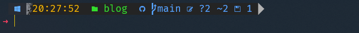
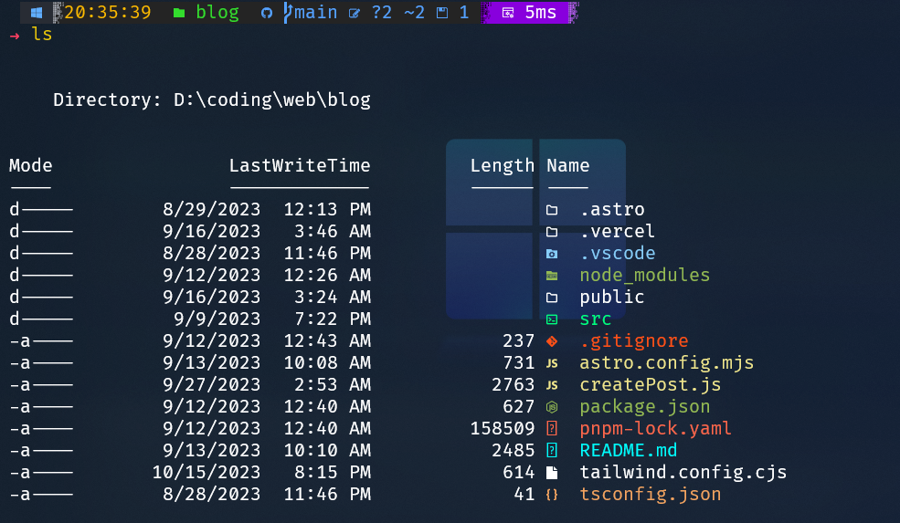
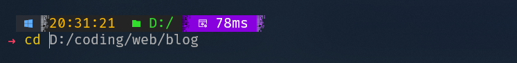

Hi 👋🏻! Today I'm gonna talk about how I setup windows powershell on my windows machine. As a developer, I think having a nice looking terminal and some good useful tools can push towards being a little more productive.

## Terminal Application

There are many terminal application for windows, but my favourite is the pre packaged **Windows Terminal App**.
It is :

- Visually Appealing
- Highly customizable
- Tabs Support.

## Customizing the Appearance of Windows Terminal

First and foremost, set the Windows Terminal as your default Terminal App.

Access your settings with a quick `Ctrl + ,` shortcut. Within the settings menu, find the option to change the default Terminal Application for your machine, and select `windows terminal` from the dropdown.

With your default terminal all sorted! 💫  
Now it's time to give it a fresh look.
I'm all about that cool acrylic aesthetic in my Terminal App.  
**Open settings** 👉, then, on the left-hand-side menu, head to 👉 **Profiles**, and within that, navigate to 👉 **Defaults**. Inside the default settings, you'll find 👉 **Appearance**.
Now, here's where you can tweak the theme to match your style.
I, for one, love to throw in a **Background Image** and give the **Terminal a bit of blur** for that extra flair.

## Installing Scoop

[Scoop](https://scoop.sh) is your go-to Windows package manager, much like Ubuntu's apt and Fedora's dnf. It simplifies the management of apps and binaries on your Windows machine. With a single command, you can easily update, install, or delete binaries, eliminating the need for manual configuration of environment variables and paths. Scoop offers various buckets filled with a wide range of apps, and it even makes font installation a breeze.

Before we start customizing the prompt I recommend installing the **[SCOOP](https://scoop.sh)** package manager for windows, It will make our work very easy moving froward.

In your terminal run these commands one by one:

```powershell
Set-ExecutionPolicy RemoteSigned -Scope CurrentUser
irm get.scoop.sh | iex
```

This will install SCOOP in your system.

## NERD Font Installation with Scoop

Before customizing your prompt with glyphs and symbols like the GitHub or folder icons, you'll need to install a NERD font. Regular fonts just can't handle these unique characters, but the NERD fonts have got you covered. You can explore other nerd fonts at (https://nerdfonts.com).

My personal favorite NERD font is Cascadia-Code, and here's where the Scoop magic comes into play. If you've ever attempted to install a custom font, you're aware that it often involves multiple steps. Scoop simplifies the process to just one command. Here's how it's done:

1. Start by adding the NERD Font bucket to your Scoop setup:

```powershell
scoop bucket add nerd-fonts
```

2. Next, install the Cascadia Code NERD font with this command:

```powershell
scoop install Cascadia-Code
```

This straightforward process will add the Cascadia-Code font to your system, making it available for you to use.

### Changing Your Terminal Font

Now that you have the NERD font installed, it's time to change your terminal font to Cascadia-Code. Here's how to do it:

1. Navigate to your terminal's settings.
2. Look for "Defaults" and then "Appearance."
3. In the "Font Face" option, select "Cascadia-Code."

With these simple steps, you'll have your terminal decked out with the NERD font of your choice, ready to make your prompt uniquely yours.

## Customizing the prompt using OH-MY-POSH.

**[Oh-My-Posh](https://ohmyposh.dev/)**, is my favourite tool for making my prompt look super cool. It gives my terminal a unique, fancy style. Oh-My-Posh makes it super easy. A nice prompt makes a dev life easier.

### Getting Oh-My-Posh Installed

Te main bucket is already added, you can skip this if you want...

```powershell
scoop bucket add main
```

Get yourself oh-my-posh.

```powershell
scoop install oh-my-posh
```

Now that oh-my-posh is installed its time to configure our windows profile script.

## Setting Up Your PowerShell Profile


PowerShell profile, it's like a special script that runs whenever you start up PowerShell. You can do all sorts of things with it to make your PowerShell experience more awesome. You can add shortcuts, like nicknames, and extra tools that load up when you start PowerShell. Plus, you can make your own special functions to fit the way you work. It's like a power-up for PowerShell!

To open your PowerShell profile in Notepad, just type this command:

```powershell
notepad $profile
```

If you come across an error, don't worry! You can fix it with this command:

```powershell
New-Item -Path $PROFILE -Type File -Force
```

Give it a try, and then open your profile again. If you haven't made any changes before, your profile will be empty.

To make your prompt look like mine, add this line to your profile and save it:

```PowerShell
oh-my-posh init pwsh --config "C:\Users\anitj\scoop\apps\oh-my-posh\17.12.0\themes\craver.omp.json" | Invoke-Expression
```

After saving, close and reopen the terminal to reload the profile. It'll make your PowerShell prompt like mine and everything will work together smoothly.

You can also change the prompt theme to match your preferences. For more information and customization options, you can refer to the oh-my-posh documentation at this link: 'https://ohmyposh.dev/docs/installation/customize'. It's a great resource for tailoring your PowerShell experience exactly the way you like it.

Sure, let's briefly discuss how to install two essential PowerShell modules: "Terminal Icons" and "PSReadLine."

## Install Terminal Icons.


Terminal Icons is a module that adds icons to your terminal for a visually enhanced experience. You can install it by following these steps:

- Open PowerShell.
- Use the following command to install Terminal Icons:

```powershell
Install-Module -Name Terminal-Icons -Scope CurrentUser
```

- You may be prompted to install the module from the PSGallery repository. Confirm the installation.

Now, you have Terminal Icons installed, and it will automatically enhance your terminal interface with icons for files and folders, making it easier to navigate.

Now add this line to your **profile**

```powershell
Import-Module -Name Terminal-Icons
```

## Install PSReadLine



PSReadLine is a module that enhances the PowerShell command line editing experience. It adds features like syntax highlighting, tab completion, and more. To install it, follow these steps:

- Open PowerShell.
- Use the following command to install PSReadLine:

```powershell
Install-Module -Name PSReadLine -Scope CurrentUser
```

- Confirm the installation if prompted.

Once PSReadLine is installed, it will significantly improve your PowerShell command line editing capabilities. You can customize it further by modifying your PowerShell profile.

Now append this line to your **profile**

```powershell
Import-Module -Name Terminal-Icons
```

These modules, Terminal Icons and PSReadLine, can enhance your PowerShell experience by providing a more visually appealing interface and improving your command line editing capabilities.

> Now reload your poweshell by closing and reopening the terminal.

## Custom Functions for Enhanced PowerShell Workflow

In PowerShell, you can tailor your experience by adding custom functions that simplify common tasks and streamline your workflow.
I use the below functions to make my life easier.

### Git Functions

#### 1. `gcom` - Simplify Git Commits

The `gcom` function streamlines the process of committing changes in a Git repository. It's perfect for those who frequently make Git commits. Here's how it works:

```powershell
function gcom {
    git add .
    git commit -m "$args"
}
```

When you run `gcom "Your commit message here"`, it automatically stages all changes and commits them with the provided message. No need to run separate `git add` and `git commit` commands.

#### 2. `lazyg` - Commit and Push in One Step

For an even more streamlined Git workflow, the `lazyg` function takes the automation a step further. It stages changes, commits with your message, and then pushes the changes to the remote Git repository:

```powershell
function lazyg {
    git add .
    git commit -m "$args"
    git push
}
```

Use it like this: `lazyg "Your commit message here"`. This "lazy" approach automates multiple steps, making your Git interactions even more efficient.

### Utility Functions

#### 3. `which` - Locate Command Definitions

The `which` function is a handy utility for pinpointing the location of a specific command or function within your PowerShell environment. It takes a command name as an argument and returns its definition. For example:

```powershell
function which($name) {
    Get-Command $name | Select-Object -ExpandProperty Definition
}
```

Running `which Get-ChildItem` will reveal the definition of the `Get-ChildItem` command in your environment.

#### 4. `whichdir` - Find Command Directories

Similar to `which`, the `whichdir` function returns the directory path where a command or function is defined. It uses the `Split-Path` cmdlet to extract the directory path:

```powershell
function whichdir($name) {
    $directory = Split-Path -Parent (Get-Command $name | Select-Object -ExpandProperty Definition)
    return $directory
}
```

Executing `whichdir Get-ChildItem` will provide the directory where `Get-ChildItem` is defined.

By adding these custom functions to your PowerShell profile, you ensure they are available each time you open PowerShell. They not only simplify Git-related tasks but also help you explore your PowerShell environment efficiently.
