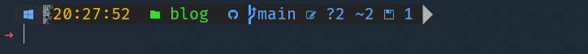
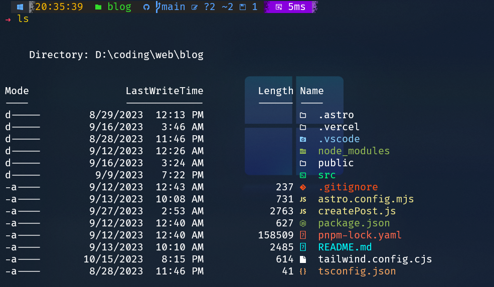
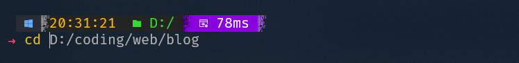

Hi 👋🏻! Today I'm going to walk through how I set up PowerShell on my Windows machine. As a developer, I think a nice-looking terminal with a few good tools genuinely makes you a little more productive. At the very least, it makes you want to open it.

By the end you'll have:

- **Windows Terminal** as the default terminal, with a background and a bit of blur
- **Scoop** to install everything with one command
- A **Nerd Font**, so icons and glyphs actually render
- An **Oh My Posh** prompt that shows your folder, Git branch and status
- **Terminal-Icons** for file and folder icons in `ls`
- **PSReadLine** autocomplete from your history
- A few **profile functions** that save a lot of typing

The whole thing takes about 15 minutes.

## Terminal application

There are many terminal apps for Windows, but my favourite is the one that already ships with it: **Windows Terminal**. It's:

- visually appealing
- highly customizable
- tabbed, so you can have PowerShell, WSL and cmd side by side

If it's not on your machine, install it from the Microsoft Store.

> While you're at it, consider installing **PowerShell 7** (`winget install Microsoft.PowerShell`). The blue "Windows PowerShell" that comes with Windows is 5.1 and hasn't changed in years. Everything in this post works in both, but PowerShell 7 is faster and gets the newest PSReadLine features.

## Making Windows Terminal the default and giving it a look

First, set Windows Terminal as your default terminal app. Open settings with `Ctrl + ,`. On the **Startup** page, set **Default terminal application** to **Windows Terminal**.

Now for the fun part. I'm all about that acrylic look.

Open **Settings** 👉 **Profiles** 👉 **Defaults** 👉 **Appearance**. This is where you tweak the theme to your style. I like to add a **background image** and turn on **acrylic** (the blur) for that extra flair. Keep the background dim, or dial the image opacity down, so text stays readable.

## Installing Scoop

[Scoop](https://scoop.sh) is a package manager for Windows, much like `apt` on Ubuntu or `dnf` on Fedora. One command installs, updates or removes an app. No installers, no clicking "Next" five times, and no fiddling with environment variables or `PATH`. It even makes installing fonts painless, which we'll need in a minute.

Run these one at a time in PowerShell (not as administrator):

```powershell
Set-ExecutionPolicy RemoteSigned -Scope CurrentUser
irm get.scoop.sh | iex
```

The first line allows locally created scripts (like your profile) to run for your user. Without it, PowerShell refuses to run the Scoop installer and, later, your profile. The second line downloads and runs the installer.

## Installing a Nerd Font with Scoop

Before your prompt can show glyphs like the GitHub logo or folder icons, you need a **Nerd Font**. Regular fonts don't include these characters, so you'd see empty boxes. Nerd Fonts are popular coding fonts patched with thousands of extra icons. You can browse them at [nerdfonts.com](https://www.nerdfonts.com/).

My favourite is Cascadia Code, and this is where Scoop shines. Installing a font normally takes several steps. With Scoop it's two commands:

1. Add the Nerd Fonts bucket (a bucket is Scoop's name for a collection of apps):

```powershell
scoop bucket add nerd-fonts
```

2. Install the font:

```powershell
scoop install Cascadia-Code
```

> If some icons still show up as empty boxes later, you probably have a version without the extra glyphs. Run `scoop search cascadia` to see the Nerd Font variants and install one of those instead.

### Changing your terminal font

1. Open Windows Terminal settings.
2. Go to **Profiles** 👉 **Defaults** 👉 **Appearance**.
3. Under **Font face**, pick the Cascadia font you just installed.

Your terminal is now ready for a fancy prompt.

## Customizing the prompt with Oh My Posh

[Oh My Posh](https://ohmyposh.dev/) is my favourite tool for making the prompt look great. Beyond looks, a good prompt tells you where you are at a glance: current folder, Git branch, whether you have uncommitted changes, and how long the last command took.

### Installing Oh My Posh

The `main` bucket is added by default when you install Scoop, but running this again doesn't hurt:

```powershell
scoop bucket add main
```

Then install it:

```powershell
scoop install oh-my-posh
```

## Setting up your PowerShell profile



Your PowerShell **profile** is a script that runs every time PowerShell starts. It's where all the customization lives: which prompt to load, which modules to import, your aliases and your own functions. Think of it as a power-up for PowerShell.

Open it in Notepad:

```powershell
notepad $PROFILE
```

If you get an error saying the file doesn't exist, create it first:

```powershell
New-Item -Path $PROFILE -Type File -Force
```

Then run `notepad $PROFILE` again. If you've never touched it, it'll be empty.

> PowerShell 7 and Windows PowerShell 5.1 each have **their own** profile file. If you use both, you'll need to set up each one. `$PROFILE` always points to the right one for the shell you're in.

To make your prompt look like mine, add this line and save:

```powershell
oh-my-posh init pwsh --config "C:\Users\anitj\scoop\apps\oh-my-posh\17.12.0\themes\craver.omp.json" | Invoke-Expression
```

That path includes the version number, so it breaks the next time Oh My Posh updates. A sturdier version uses the `POSH_THEMES_PATH` variable that the install sets up:

```powershell
oh-my-posh init pwsh --config "$env:POSH_THEMES_PATH\craver.omp.json" | Invoke-Expression
```

Close and reopen the terminal to reload the profile, and your prompt should look like mine.

`craver` is just the theme I like. Run `Get-PoshThemes` to preview all the built-in themes right in your terminal, then swap the file name. For more options, see the [Oh My Posh customization docs](https://ohmyposh.dev/docs/installation/customize).

## Installing Terminal-Icons



[Terminal-Icons](https://github.com/devblackops/Terminal-Icons) adds file and folder icons to `ls` and `Get-ChildItem`, colour-coded by file type. It sounds small, but it makes scanning a folder so much faster.

Install it:

```powershell
Install-Module -Name Terminal-Icons -Repository PSGallery -Scope CurrentUser
```

If PowerShell asks whether you trust the PSGallery repository, say yes.

Then add this to your **profile**:

```powershell
Import-Module -Name Terminal-Icons
```

## Autocomplete with PSReadLine



[PSReadLine](https://github.com/PowerShell/PSReadLine) handles everything about typing on the PowerShell command line: syntax highlighting, tab completion, history search and, my favourite, **predictions**. As you type, it suggests the rest of the command from your history, like in the screenshot above.

PowerShell already comes with PSReadLine, but often an old version. Update it:

```powershell
Install-Module -Name PSReadLine -Scope CurrentUser -Force
```

Then add this to your **profile**:

```powershell
Import-Module -Name PSReadLine

# Suggest commands from history as you type (press → to accept)
Set-PSReadLineOption -PredictionSource History
# Show suggestions as a list you can arrow through (press F2 to toggle)
Set-PSReadLineOption -PredictionViewStyle ListView

# Tab shows a menu of completions instead of cycling through them
Set-PSReadLineKeyHandler -Key Tab -Function MenuComplete
# ↑ and ↓ search history for commands starting with what you've typed
Set-PSReadLineKeyHandler -Key UpArrow -Function HistorySearchBackward
Set-PSReadLineKeyHandler -Key DownArrow -Function HistorySearchForward
```

> The `ListView` style needs PSReadLine 2.2 or newer. If you see an error about it, the update above didn't take. Run `Get-Module PSReadLine` to check the version.

Reload your terminal by closing and reopening it.

## Custom functions for a faster workflow

This is where the profile really pays off. You can add your own functions for things you type every day. These are the ones I use.

### Git functions

#### 1. `gcom`: stage and commit in one go

```powershell
function gcom {
    git add .
    git commit -m "$args"
}
```

Run `gcom "your commit message"` and it stages everything and commits it with that message. No separate `git add` and `git commit`.

#### 2. `lazyg`: stage, commit and push

For when you're feeling extra lazy, `lazyg` does all three:

```powershell
function lazyg {
    git add .
    git commit -m "$args"
    git push
}
```

Use it like `lazyg "your commit message"`.

> Both of these stage **everything** with `git add .`. Keep an eye on `git status` so you don't commit something you didn't mean to.

### Utility functions

#### 3. `which`: find where a command comes from

Linux has `which`; PowerShell doesn't. This gets you close:

```powershell
function which($name) {
    Get-Command $name | Select-Object -ExpandProperty Definition
}
```

`which git` prints the full path to `git.exe`. For PowerShell functions, it prints the function's code.

#### 4. `whichdir`: find the folder a command lives in

```powershell
function whichdir($name) {
    $directory = Split-Path -Parent (Get-Command $name | Select-Object -ExpandProperty Definition)
    return $directory
}
```

`whichdir git` gives you the folder that `git.exe` lives in. That's handy when you're chasing down which of two installs is on your `PATH`.

### Aliases

Aliases are shorter names for commands you already have. For example:

```powershell
Set-Alias -Name g -Value git
```

Now `g status` works like `git status`. Aliases can only point to a single command, so anything with arguments (like `gcom` above) needs to be a function.

## My full profile

Here's everything from this post in one place, ready to paste into `notepad $PROFILE`:

```powershell
# Prompt
oh-my-posh init pwsh --config "$env:POSH_THEMES_PATH\craver.omp.json" | Invoke-Expression

# Modules
Import-Module -Name Terminal-Icons
Import-Module -Name PSReadLine

# PSReadLine
Set-PSReadLineOption -PredictionSource History
Set-PSReadLineOption -PredictionViewStyle ListView
Set-PSReadLineKeyHandler -Key Tab -Function MenuComplete
Set-PSReadLineKeyHandler -Key UpArrow -Function HistorySearchBackward
Set-PSReadLineKeyHandler -Key DownArrow -Function HistorySearchForward

# Aliases
Set-Alias -Name g -Value git

# Git
function gcom { git add .; git commit -m "$args" }
function lazyg { git add .; git commit -m "$args"; git push }

# Utilities
function which($name) { Get-Command $name | Select-Object -ExpandProperty Definition }
function whichdir($name) { Split-Path -Parent (Get-Command $name | Select-Object -ExpandProperty Definition) }
```

## Troubleshooting

**"Running scripts is disabled on this system."** Run the `Set-ExecutionPolicy RemoteSigned -Scope CurrentUser` line from the Scoop section.

**Icons show up as empty boxes or question marks.** Your terminal isn't using a Nerd Font. Check **Font face** in the Windows Terminal settings.

**PowerShell takes a while to start.** Each module and the prompt add a little time. To see how long your profile takes, run `Measure-Command { . $PROFILE }`. If it's slow, try a simpler Oh My Posh theme first.

**The prompt looks right in one shell but not the other.** PowerShell 7 and 5.1 have separate profiles, so set up both.

That's my setup. Tweak it until it feels like yours. Your terminal is where you spend half your day, so it might as well be nice. ✨
