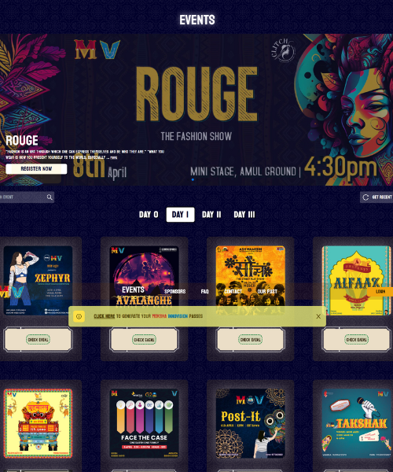
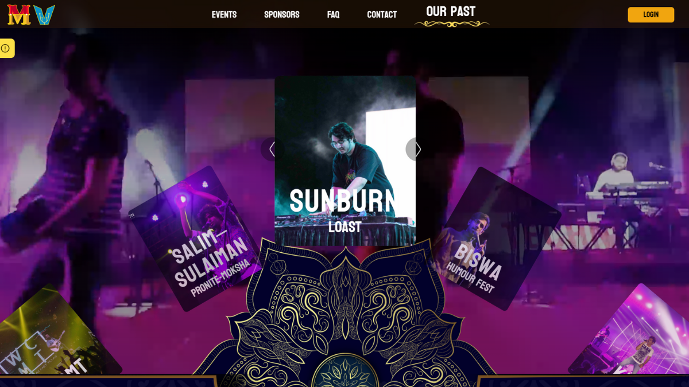
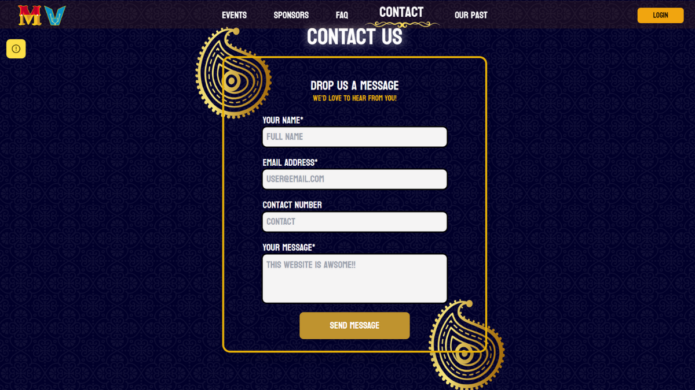
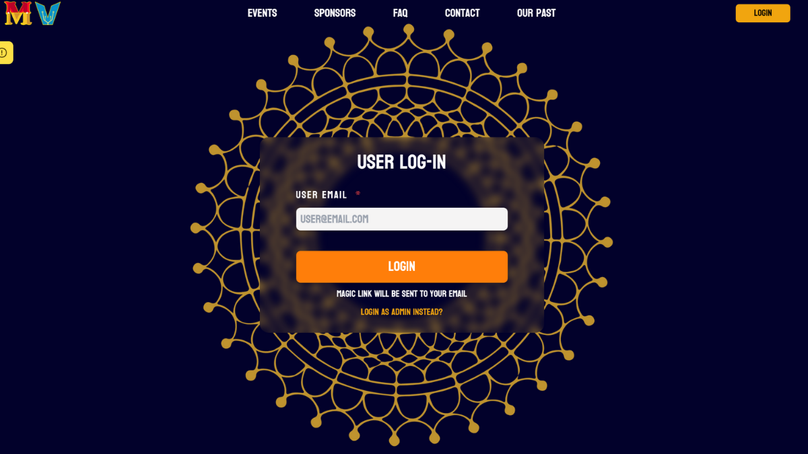

## My Experience Building the Moksha Innovision Website

Hey there, I'm Anit Jha, and I recently had the opportunity to work on something pretty exciting - the website for Moksha Innovision, the annual fest of NSUT Delhi. It was a fantastic experience, and I'd love to share a bit about it.

## The Numbers Don't Lie

First things first, let's talk about the numbers. Last year, in 2023, Moksha Innovision attracted a whopping 80,000 attendees. Yes, you read that right! It's a massive event, and I was thrilled to be a part of it.

## The Tech Stack

Now, let's dive into the technical side of things. The website I built for Moksha Innovision was a mix of cutting-edge technologies. We used:

- **Three.js**: This JavaScript library allowed us to create stunning 3D effects and animations on the website.
- **TypeScript**: For that extra layer of type safety and code quality.
- **Next.js**: A React framework that made building a fast and efficient website a breeze.
- **Supabase**: To handle the backend and database needs.
- **Authentication Role-Based**: Ensuring that only authorized users could access certain parts of the website.

## The Functionalities

The website wasn't just a pretty face; it had some powerful features too. We designed it with both event managers and attendees in mind:

### Event Managers

- They could easily create events, complete with registration forms for participants.
- A dashboard allowed them to keep tabs on who had registered for their events.

### Participants

- Participants could see which events they were a part of and who their team members were.

## The Aesthetics

The theme we went for was a blend of traditional and modern, with captivating mandala effects sprinkled throughout the website. It gave the site a unique and eye-catching look that matched the spirit of Moksha Innovision.

## Spotlight on Pages

Let's take a visual tour of some of the key pages:

### Events Page

This page served as the heart of the website, showcasing all the fantastic events happening during Moksha Innovision.

### Legacy Page

A tribute to the festival's history and past glories.

### Contact Page

A place to get in touch with the organizers for queries and information.

### Login Page

Where users could access their accounts, and event managers could log in to manage their events.

## In Conclusion

Building the Moksha Innovision website was an incredible experience, and I'm proud of what our team achieved. It's a testament to the power of technology in bringing people together and making large-scale events like this possible.

I hope you enjoyed this brief journey through my work on the Moksha Innovision website. If you were a part of the fest last year, I hope you had a great time navigating the website, and if you're reading this in preparation for the next Moksha Innovision, get ready for an amazing experience!
