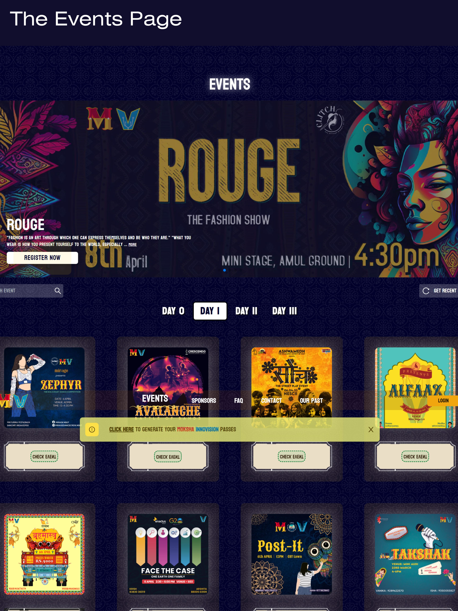
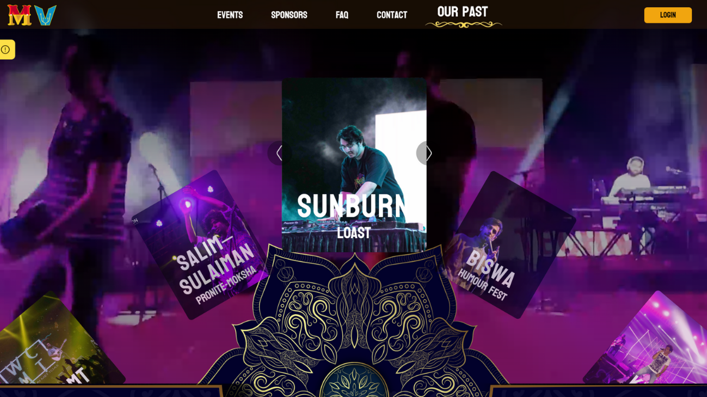
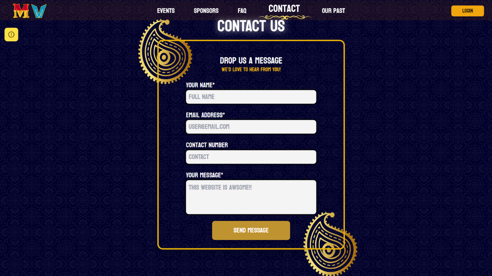
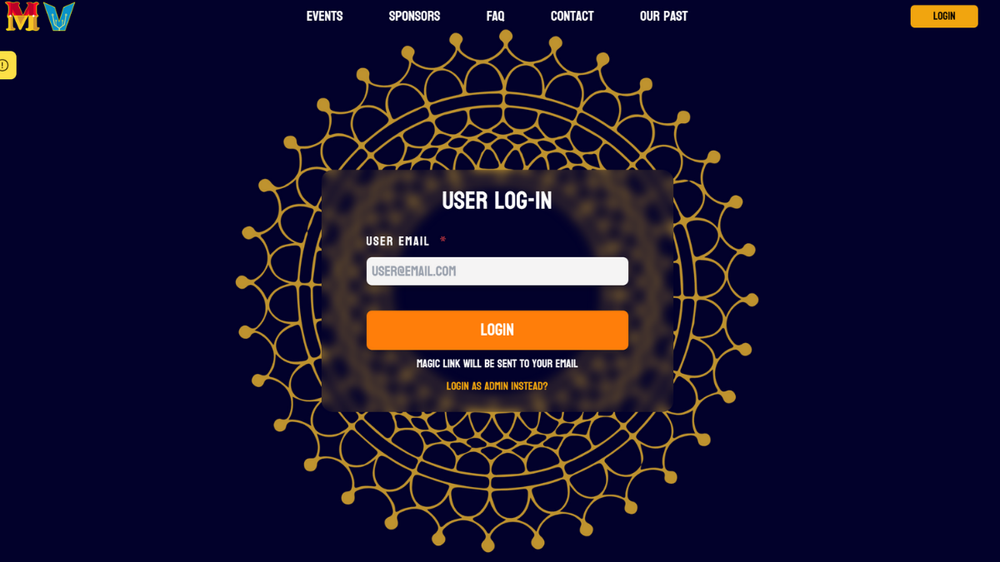

**Moksha Innovision** is the annual fest of NSUT Delhi, my university. In 2023 it drew around **80,000 attendees**. I worked on the fest's website, [mokshansut.com](https://mokshansut.com/events), with the web team, and I'm proud of what we built.

## The brief

A fest this size runs a lot of events, each organised by a different team. The site had to be one place where:

- attendees could find every event and register for it
- **organisers could run their own events**: create them, collect registrations and see who's coming, without needing the web team

## What it does

### For organisers

- Create an event with its own **registration form**.
- See everyone who registered from a **dashboard**.
- Manage **only their own** events.

### For participants

- Browse the events at the fest and **register**, alone or as a team.
- See all the events you're part of in one place, and **who your teammates are**.

## Role-based access

With many organisers on the same site, permissions mattered. Access is **role-based**: the site knows whether you're a participant or an organiser, and organisers can only see and manage the events that belong to them. Auth, the database and those access rules are built on **Supabase**.

## The look

The theme blends traditional and modern: **mandala** effects throughout, with 3D touches built in **Three.js**.

## Working as a team

I built this with my teammate Harsh, and we sometimes ended up editing the same files at the same time. Stash your changes, pull, put them back, fix the conflict: it happened often enough that I wrote the workflow up in [Git Stash: A Practical Beginner's Guide](/blog/git-stash).

## Pages

### Events

The heart of the site: every event at the fest, with registration built in.

### Legacy

A look back at the fest's history.

### Contact

How to reach the organisers.

### Login

Where participants sign in and organisers get to their dashboards.

## Under the hood

- **Next.js** and **TypeScript**
- **Three.js** for the 3D effects
- **Supabase** for auth, the database and role-based access
